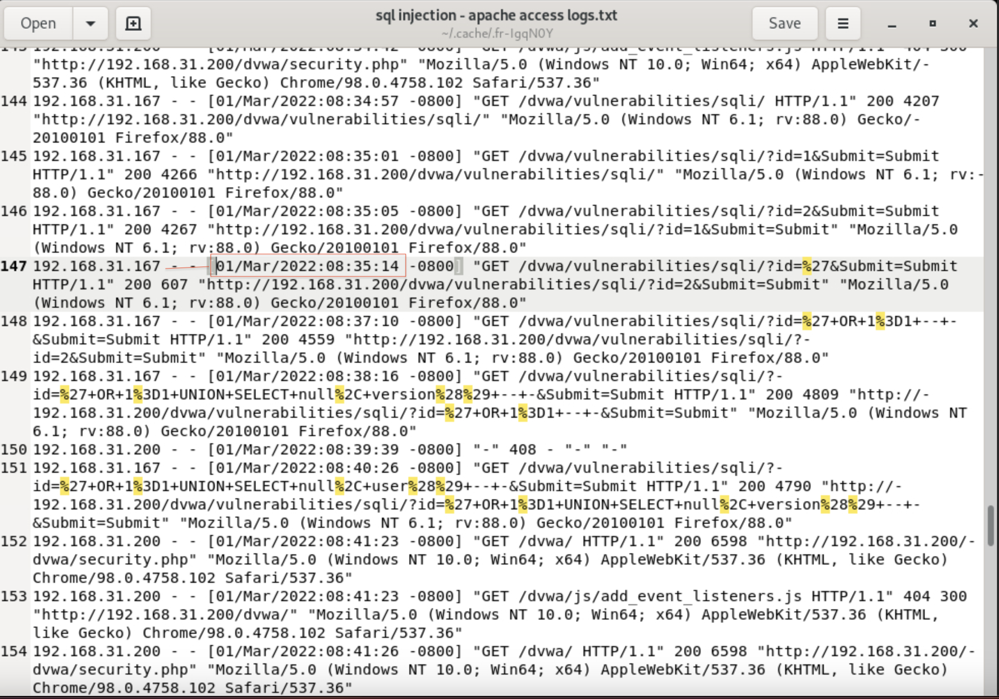
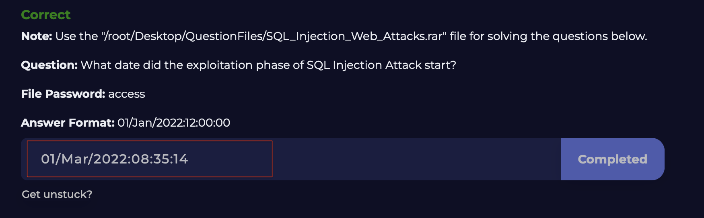
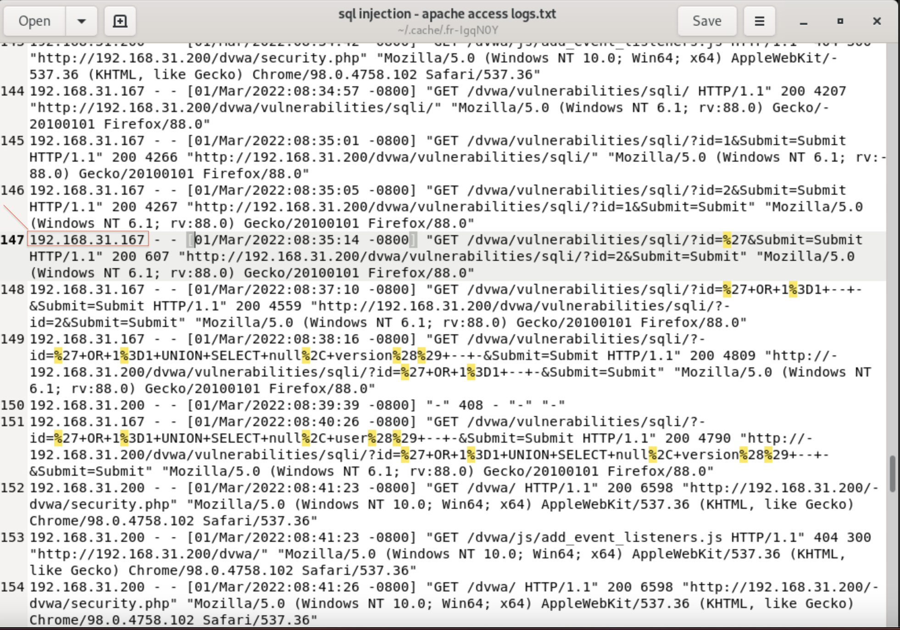
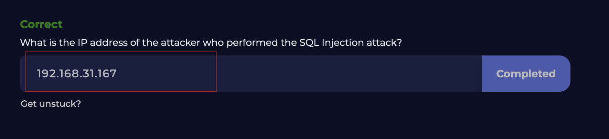
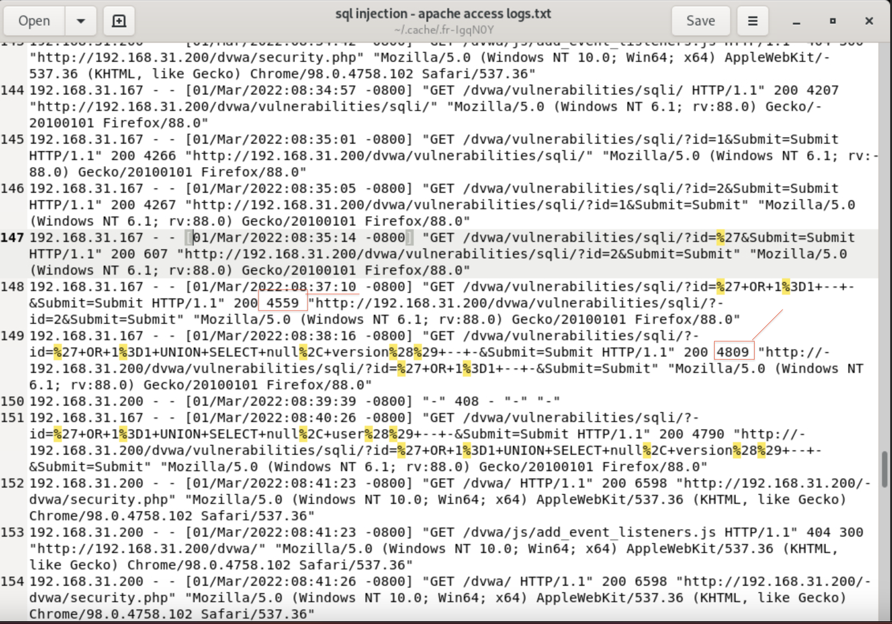
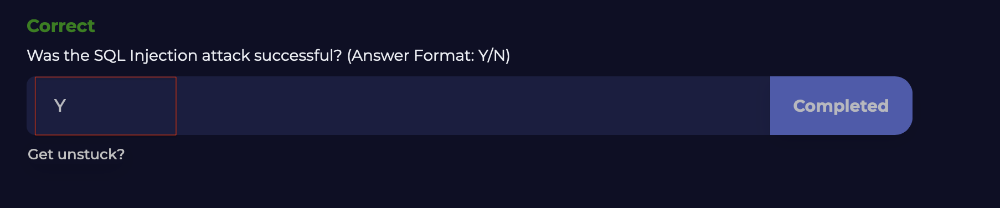
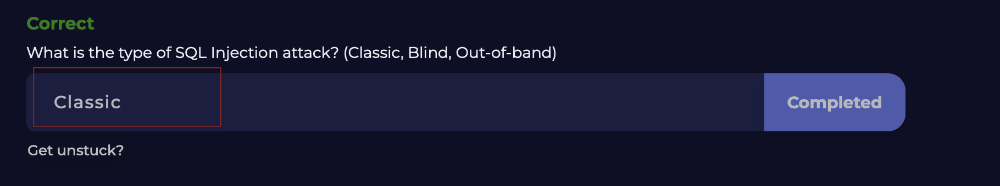

# Detecting-SQL-Injection-Attacks

I completed the Detecting SQL Injection Attacks Lab on LetsDefend. I gained insights into the following topics:

✅ What is SQL Injection

✅ Types of SQL Injection

✅ How SQL Injection Works

✅ What Attackers Gain from SQL Injection Attacks

✅ How to Prevent SQL Injections

✅ How to Detect SQL Injection Attacks

## Finding the Answer to Question 1

## Question 1 Correct Answer

## Finding the Answer to Question 2

## Question 2 Correct Answer

## Finding the Answer to Question 3

## Question 3 Correct Answer

## Question 4 Correct Answer

